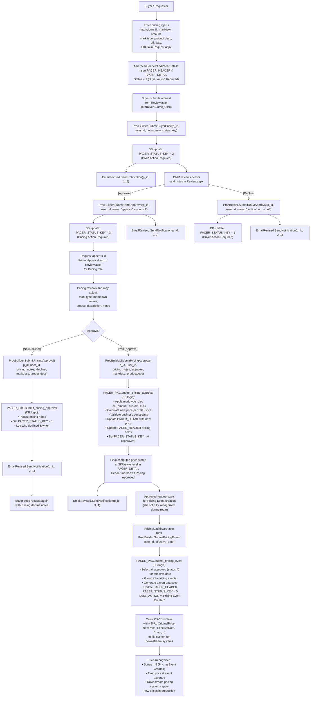
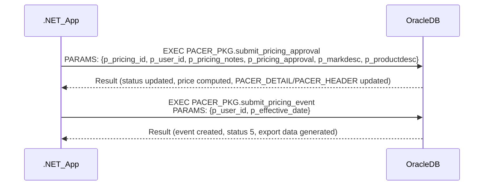
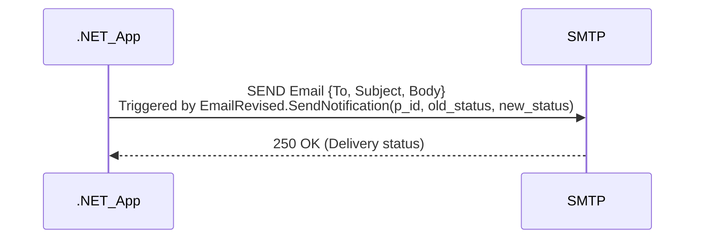
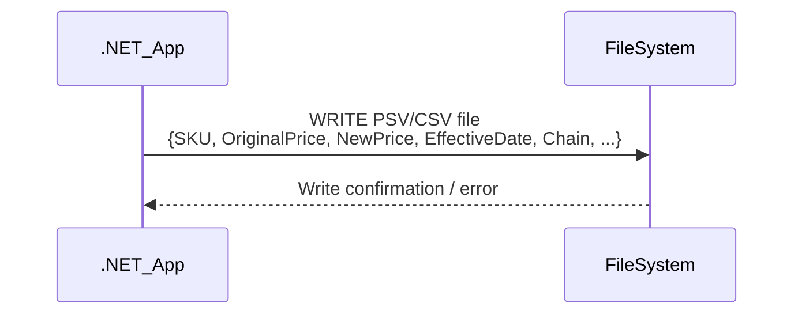

# Pricing Approval Workflow - Functional & Integration Documentation

## 1. Functional Flow Diagrams

### 1.1 Pricing Approval Request (Technical Execution Flow)

---

## 2. End-to-End Pricing Determination & Recognition Lifecycle

### 2.1 Pricing Input Capture & Validation

- **User Action:** Buyer enters pricing request in `Request.aspx` (inputs: markdown %, markdown amount, mark type, product description, effective date, SKUs/styles/colors, org selection).
- **Input Mapping:** UI fields are mapped to a `Pacer` object and details (see `AddPacerHeader`, `AddPacerDetails` in `Request.aspx.cs`).
- **Validation:** 
    - Required fields, price endings, non-zero/blank prices, duplicate detection, org/chain/store validation.
    - Methods: `CheckRequiredFields`, `PeformSubmitValidation`, `ValidateGVPriceEnding`, etc.
    - Invalid entries are highlighted and must be resolved before submission.

### 2.2 Draft Save & Submission

- **Draft Save:** On initial save, `AddPacerHeader` and `AddPacerDetails` insert records into `PACER_HEADER` and `PACER_DETAIL` tables with `PACER_STATUS_KEY = 1` (Buyer Action Required).
- **Submission:** On submit, `btnSubmit_Click` in `Request.aspx.cs` triggers validation, then inserts/updates header and details, and redirects to `Review.aspx`.

### 2.3 Review & Approval Workflow

- **Review:** In `Review.aspx`, the request is loaded for review by DMM and Pricing roles.
- **DMM Approval:** 
    - DMM can approve (`btnDMMApprove_Click`) or decline (`btnDMMDecline_Click`).
    - Approval: `ProcBuilder.SubmitDMMApproval` sets status to 3 (Pricing Action Required) or 4 (if on-cadence).
    - Decline: Status set to 1 (Buyer Action Required), notes saved.
    - Notifications sent via `EmailRevised.SendNotification`.
- **Pricing Approval:** 
    - Pricing can approve (`btnPricingApprove_Click`) or decline (`btnPricingDecline_Click`).
    - Approval: `ProcBuilder.SubmitPricingApproval` sets status to 4 (Approved), applies mark rules, computes prices, updates header/details.
    - Decline: Status set to 1, notes saved.
    - Notifications sent.

### 2.4 Pricing Determination Logic

- **Computation:** 
    - `ProcBuilder.SubmitPricingApproval` calls `PACER_PKG.submit_pricing_approval` (Oracle stored procedure).
    - Applies mark type (%, amount, custom), computes new price per SKU/style, validates constraints.
    - Updates `PACER_DETAIL` and `PACER_HEADER` with computed prices and approval metadata.
- **Status Transition:** 
    - Status moves from 3 (Pricing Action Required) to 4 (Approved) on approval.
    - Decline returns to 1 (Buyer Action Required).

### 2.5 Recognition & Event Creation

- **Recognition:** 
    - Approved requests (status 4) are not yet "recognized" until a pricing event is created.
    - In `PricingDashboard.aspx`, batch operation triggers `ProcBuilder.SubmitPricingEvent`, which calls `PACER_PKG.submit_pricing_event`.
    - All status 4 requests for the effective date are grouped, event created, status set to 5 (Pricing Event Created).
- **Export:** 
    - Event creation triggers export of pricing data to PSV/CSV files for downstream systems.
    - Files include SKU, original price, new price, effective date, chain, etc.
    - Status 5 indicates price is officially recognized and effective.

### 2.6 Batch Operations

- **Batch Approval:** 
    - In `PricingApproval.aspx`, `btnApproveSelected_Click` allows batch approval of multiple requests.
    - Iterates selected requests, calls `ProcBuilder.SubmitPricingApproval` and sends notifications.
- **Event Export:** 
    - `ProcBuilder.SubmitPricingEvent` and related export methods generate files for external consumption.

### 2.7 Status Key Mapping

| Status Key | Meaning                        |
|------------|-------------------------------|
| 1          | Buyer Action Required (Draft/Declined) |
| 2          | DMM Action Required            |
| 3          | Pricing Action Required        |
| 4          | Pricing Approved (not yet recognized) |
| 5          | Pricing Event Created (Recognized) |

---

## 3. Core Business Functionalities

| Functionality Name           | Description                                                                 | Main Classes/Files                      | Key Business Rules/Validations                                                                                 | Actors                |
|-----------------------------|-----------------------------------------------------------------------------|-----------------------------------------|----------------------------------------------------------------------------------------------------------------|-----------------------|
| Pricing Determination & Recognition | End-to-end logic for capturing, validating, approving, and recognizing prices | Request.aspx.cs, Review.aspx.cs, PricingApproval.aspx.cs, ProcBuilder.cs, PACER_PKG (DB) | Inputs mapped, validated, computed via mark type rules, status transitions, batch event creation, export, notifications | Buyer, DMM, Pricing   |
| Order Validation & Lifecycle| Validation of request fields, price endings, duplicate detection, status transitions | Request.aspx.cs, Review.aspx.cs         | Required fields, price ending rules, duplicate detection, org/store/chain validation                            | Buyer, DMM, Pricing   |
| Dashboard & Reporting       | Dashboard display and filtering of pricing requests                          | PricingApproval.aspx.cs, ProcBuilder.cs | Filter by status, request type, effective date, buying area; DataTable binding                                  | Pricing, Admin        |
| User Management & RBAC      | Role-based access and UI enablement/authorization                            | MySession.cs, PricingApproval.aspx.cs, Review.aspx.cs | Only PRICING_SUPER_USER can access PricingApproval.aspx; UI controls enabled/disabled per role and status      | All roles             |
| Alerting & Email Notifications | Automated email notifications on status transitions                        | EmailRevised.cs, PRAEmail.cs            | Dynamic recipient list, status-based subject/body, links to review, triggers on approval/decline               | Buyer, DMM, Pricing   |
| Bulk Operations             | Batch approval of requests, batch event creation and export                  | PricingApproval.aspx.cs, ProcBuilder.cs | Approve multiple requests, batch event creation for recognition/export                                          | Pricing               |
| Exception Handling & Audit  | Error handling, audit logging, user action tracking                         | ProcBuilder.cs, PCRDAL.cs, Web.config   | Logging via WriteToLog, error catching in dropdown/data methods, audit via DB procedures                       | All                   |
| Administrative Utilities    | Maintenance, data export, configuration                                     | Maintenance.aspx, Export methods        | Export to CSV/PSV, maintenance utilities                                                                       | Admin, Pricing        |

#### Core Functionality Block: **Pricing Determination & Recognition**

- **How pricing is determined:**
    - Inputs (markdown %, amount, mark type, product desc, effective date, SKUs) are captured in `Request.aspx.cs` and mapped to `Pacer` objects.
    - On approval, `ProcBuilder.SubmitPricingApproval` calls `PACER_PKG.submit_pricing_approval` (Oracle stored proc) with all relevant parameters.
    - Stored proc applies business rules (mark type, amount/percent, constraints), computes new prices, updates `PACER_DETAIL` and `PACER_HEADER`.
    - Status transitions from 3 to 4 on approval.
- **How and when price is recognized:**
    - Price is only "recognized" when a batch event is created (`ProcBuilder.SubmitPricingEvent` → `PACER_PKG.submit_pricing_event`), which sets status to 5 and exports data.
    - Event creation is typically a batch operation, not per-request.
    - Exported files are consumed by downstream pricing systems for production use.
- **References:**
    - `Request.aspx.cs` (input mapping, validation)
    - `Review.aspx.cs` (approval, status transitions)
    - `PricingApproval.aspx.cs` (dashboard, batch approval)
    - `ProcBuilder.cs` (SubmitPricingApproval, SubmitPricingEvent)
    - `PACER_PKG.submit_pricing_approval`, `PACER_PKG.submit_pricing_event` (DB logic)

---

## 4. Integration Touchpoints & Interface Diagrams

### 4.1 Database Integration (Pricing Approval & Recognition)

### 4.2 Email Notification Integration

### 4.3 File System Export for Pricing Events

---

## 5. Exception Handling and Audit Flow Extraction

- **Exception Handling:**
    - Try/catch blocks in dropdown/data binding and file operations (see `PricingApproval.aspx.cs`, `Request.aspx.cs`).
    - Errors during DB calls (e.g., invalid status, duplicate, validation error) are caught and surfaced to the user via UI alerts or error labels.
    - File upload errors (invalid format, duplicates, invalid SKUs/styles) are caught and reported to the user.
    - Email sending errors are not explicitly handled in EmailRevised.cs, but SMTP failures would be logged at the mail server.
- **Audit Logging:**
    - `ProcBuilder.WriteToLog()` logs user actions, page access, and context to the database via `merch_user.user_log`.
    - Audit fields in PACER_HEADER/PACER_DETAIL track who approved/declined, when, and with what notes.
    - All status transitions and actions are recorded in the database for traceability.
- **Error Propagation:**
    - UI disables actions on deleted/invalid requests.
    - Validation errors prevent submission and display detailed error messages.
    - Batch operations log errors and skip invalid records.

---

## 6. Appendix

### 6.1 List of Analyzed Files (Pricing Approval Workflow Only)
- PricingApproval.aspx, PricingApproval.aspx.cs
- PricingDashboard.aspx, PricingDashboard.aspx.cs
- Review.aspx, Review.aspx.cs
- Request.aspx, Request.aspx.cs
- App_Code/ProcBuilder.cs
- App_Code/EmailRevised.cs
- App_Code/MySession.cs
- App_Code/PCRDAL.cs
- App_Code/Pacer.cs, SKU.cs, Style.cs, StyleColors.cs
- App_Code/PRAEmail.cs
- Web.config

### 6.2 Glossary of Business Terms

| Term            | Definition                                                                                   |
|-----------------|----------------------------------------------------------------------------------------------|
| PACER           | Pricing Approval Change Event Request (core entity for pricing workflow)                      |
| PACER_HEADER    | DB table: header/summary for a pricing request                                               |
| PACER_DETAIL    | DB table: line-level (SKU/style) pricing details                                             |
| Pricing Event   | Batch grouping of approved requests for a given effective date, triggers recognition/export   |
| Status Key      | Integer representing workflow state (1=Buyer, 2=DMM, 3=Pricing, 4=Approved, 5=Recognized)    |
| DMM             | Divisional Merchandise Manager (approver role)                                               |
| Mark Type       | Type of markdown (percent, amount, custom, etc.)                                             |
| On/Off Cadence  | Indicates if request is on scheduled cadence or an exception                                 |
| Effective Date  | Date when new price is to take effect                                                        |
| Chain/Store     | Organizational grouping for pricing (chain-level, store-level)                               |
| Bulk Approval   | Batch approval of multiple requests in dashboard                                             |
| PSV/CSV Export  | File format for exporting recognized prices to downstream systems                            |

---

**End of Pricing Approval Workflow Documentation**
