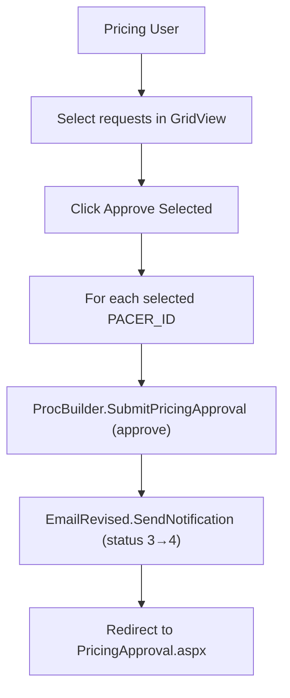
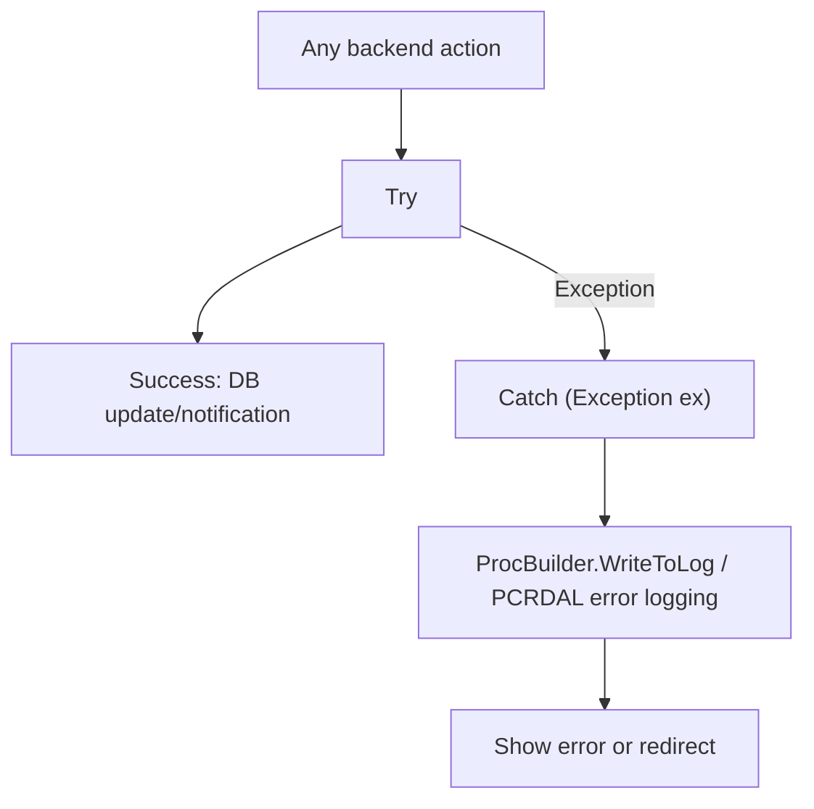
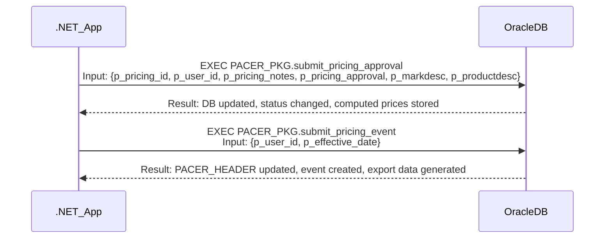
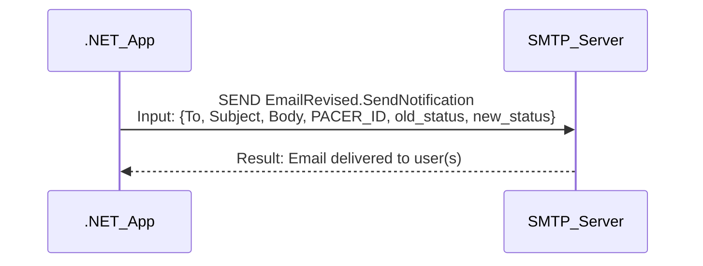
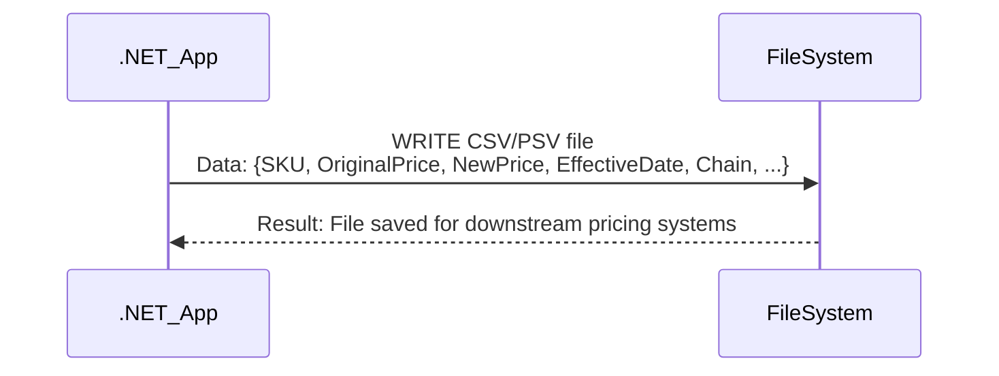

# Pricing Approval Workflow - Functional & Integration Documentation

## 1. Functional Flow Diagrams

### 1.1 Pricing Approval Request (Technical Execution Flow)

```mermaid
flowchart TD

%% ACTORS & ENTRY
Buyer["Buyer / Requestor"] --> CaptureInputs["Enter pricing inputs<br/>(markdown %, markdown amount,<br/>mark type, product desc, eff. date,<br/>SKUs) in Request.aspx"]
CaptureInputs --> SaveDraft["Insert PACER_HEADER & PACER_DETAIL<br/>Status = 1 (Buyer Action Required)"]
SaveDraft --> BuyerSubmit["Buyer submits request<br/>from Review.aspx"]
BuyerSubmit --> StatusToDMM["ProcBuilder.SubmitBuyerPrice<br/>PACER_STATUS_KEY = 2 (DMM Action Required)"]
BuyerSubmit --> NotifyBuyerSubmit["EmailRevised.SendNotification<br/>(old_status = 1, new_status = 2)"]

%% DMM LAYER
StatusToDMM --> DMMReview["DMM reviews details<br/>and notes in Review.aspx"]
DMMReview --|Approve|--> StatusToPricing["ProcBuilder.SubmitDMMApproval<br/>PACER_STATUS_KEY = 3 (Pricing Action Required)"]
DMMReview --|Approve|--> NotifyDMMApprove["EmailRevised.SendNotification<br/>(old_status = 2, new_status = 3/4)"]
DMMReview --|Decline|--> StatusBackBuyer["ProcBuilder.SubmitDMMApproval<br/>PACER_STATUS_KEY = 1 (Buyer Action Required)"]
StatusBackBuyer --> NotifyDMMDecline["EmailRevised.SendNotification<br/>(old_status = 2, new_status = 1)"]

%% PRICING REVIEW LAYER
StatusToPricing --> PricingQueue["Request appears in<br/>PricingApproval.aspx / Review.aspx<br/>for Pricing role"]
PricingQueue --> PricingEdit["Pricing reviews and may adjust:<br/>mark type, markdown values,<br/>product description, notes"]

PricingEdit --> ApproveOrDecline{"Approve?"}

%% PRICING DECLINE PATH
ApproveOrDecline --|No (Decline)|--> CallSubmitDecline["ProcBuilder.SubmitPricingApproval<br/>(p_id, user_id,<br/>pricing_notes, 'decline',<br/>markdesc, productdesc)"]
CallSubmitDecline --> PACERPkgDecline["PACER_PKG.submit_pricing_approval<br/>(DB logic):<br/>• Persist pricing notes<br/>• Set PACER_STATUS_KEY = 1<br/>• Log who declined & when"]
PACERPkgDecline --> NotifyDecline["EmailRevised.SendNotification<br/>(old_status = 3, new_status = 1)"]
NotifyDecline --> BackToBuyer["Buyer sees request again<br/>with Pricing decline notes"]

%% PRICING APPROVE PATH
ApproveOrDecline --|Yes (Approve)| --> CallSubmitApprove["ProcBuilder.SubmitPricingApproval<br/>(p_id, user_id,<br/>pricing_notes, 'approve',<br/>markdesc, productdesc)"]
CallSubmitApprove --> PACERPkgApprove["PACER_PKG.submit_pricing_approval<br/>(DB logic):<br/>• Apply mark type rules<br/>&nbsp;&nbsp;(%, amount, custom, etc.)<br/>• Calculate new price per SKU/style<br/>• Validate business constraints<br/>• Update PACER_DETAIL with new price<br/>• Update PACER_HEADER pricing fields<br/>• Set PACER_STATUS_KEY = 4 (Approved)"]

PACERPkgApprove --> PriceComputed["Final computed price stored<br/>at SKU/style level in PACER_DETAIL<br/>Header marked as Pricing Approved"]
PriceComputed --> NotifyApproved["EmailRevised.SendNotification<br/>(old_status = 3, new_status = 4)"]
PriceComputed --> AwaitEvent["Approved request waits<br/>for Pricing Event creation<br/>(still not fully 'recognized' downstream)"]

%% PRICING EVENT / RECOGNITION
AwaitEvent --> CreateEvent["PricingDashboard.aspx<br/>runs ProcBuilder.SubmitPricingEvent(<br/>user_id, effective_date)"]
CreateEvent --> PACERPkgEvent["PACER_PKG.submit_pricing_event<br/>(DB logic):<br/>• Select all approved (status 4)<br/>&nbsp;&nbsp;for effective date<br/>• Group into pricing events<br/>• Generate export datasets<br/>• Update PACER_HEADER<br/>&nbsp;&nbsp;PACER_STATUS_KEY = 5<br/>&nbsp;&nbsp;LAST_ACTION = 'Pricing Event Created'"]
PACERPkgEvent --> ExportFiles["Write PSV/CSV files<br/>with {SKU, OriginalPrice,<br/>NewPrice, EffectiveDate, Chain,...}<br/>to file system for downstream systems"]
ExportFiles --> PriceRecognized["Price Recognized:<br/>• Status = 5 (Pricing Event Created)<br/>• Final price & event exported<br/>• Downstream pricing systems apply<br/>new prices in production"]
```

### 1.2 Batch Approval Flow (PricingApproval.aspx)

### 1.3 Exception Handling & Audit Logging

---

## 2. End-to-End Pricing Determination & Recognition Lifecycle

### 2.1 Pricing Determination Logic

- **Inputs Gathered**:  
  - User enters markdown %, markdown amount, mark type, product description, effective date, SKUs/styles in Request.aspx.
  - Data is mapped to PACER_HEADER (request metadata) and PACER_DETAIL (SKU/style-level details) tables.

- **Transformation & Computation**:  
  - On approval, `ProcBuilder.SubmitPricingApproval` calls the stored procedure `PACER_PKG.submit_pricing_approval`.
  - This procedure applies mark type rules (percentage, amount, custom), validates business constraints (e.g., price cannot be below cost), and computes the new price per SKU/style.
  - Updates PACER_DETAIL rows with computed prices and PACER_HEADER with summary fields.

- **Lifecycle Statuses**:
  | Stage                   | Status Key | Description                                   | Main Field(s)         |
  |-------------------------|------------|-----------------------------------------------|-----------------------|
  | Draft                   | 1          | Buyer Action Required                         | PACER_HEADER.STATUS   |
  | Submitted to DMM        | 2          | DMM Action Required                           | PACER_HEADER.STATUS   |
  | Approved by DMM         | 3          | Pricing Action Required                       | PACER_HEADER.STATUS   |
  | Approved by Pricing     | 4          | Pricing Approved                              | PACER_HEADER.STATUS   |
  | Pricing Event Created   | 5          | Price Recognized (Event Created & Exported)   | PACER_HEADER.STATUS   |

- **Recognition as Official Price**:
  - Price is considered "official" only after event creation (status 5).
  - `ProcBuilder.SubmitPricingEvent` triggers `PACER_PKG.submit_pricing_event`, which:
    - Selects all requests with status 4 for a given effective date.
    - Groups them into pricing events.
    - Generates export datasets (CSV/PSV) for downstream systems.
    - Updates PACER_HEADER to status 5 and logs the event.
  - Exported files contain {SKU, OriginalPrice, NewPrice, EffectiveDate, Chain, ...}.

- **Batch Operations**:
  - PricingApproval.aspx allows batch approval of multiple requests.
  - PricingDashboard.aspx triggers batch event creation for all approved requests matching filters.

- **Audit & Exception Handling**:
  - All actions are logged via `ProcBuilder.WriteToLog` and PCRDAL error logging.
  - Exceptions in UI or backend redirect to error pages or display alerts.

---

## 3. Core Business Functionalities

| Functionality Name            | Description                                                                 | Main Classes/Files                      | Key Business Rules                                         | Actors                |
|-------------------------------|-----------------------------------------------------------------------------|-----------------------------------------|------------------------------------------------------------|-----------------------|
| Pricing Determination & Recognition | End-to-end pricing input, computation, approval, and recognition lifecycle | PricingApproval.aspx(.cs), Review.aspx(.cs), ProcBuilder.cs, PACER_PKG | Mark type rules, price validation, status transitions, event creation | Buyer, DMM, Pricing   |
| Dashboard & Filtering         | Filter, view, and export pricing requests by status, type, area, date       | PricingApproval.aspx(.cs), ProcBuilder.cs| Only authorized users see relevant requests                | Pricing, Buyer        |
| Batch Approval                | Approve multiple requests at once from dashboard                            | PricingApproval.aspx(.cs), ProcBuilder.cs| Only "on" requests are processed; notifications sent       | Pricing               |
| Individual Approval/Decline   | Review and approve/decline single requests                                  | Review.aspx(.cs), ProcBuilder.cs        | Role-based access, status transitions, notes required       | DMM, Pricing          |
| Validation & Exception Alerts | Show validation errors, download error files, handle business exceptions    | Review.aspx(.cs), ProcBuilder.cs        | Cannot approve if validation errors exist                  | All roles             |
| Event Creation & Export       | Create pricing events, export to file system for downstream consumption     | PricingDashboard.aspx(.cs), ProcBuilder.cs| Only approved requests for effective date included         | Pricing               |
| Email Notifications           | Notify users of status changes, approvals, declines                         | EmailRevised.cs, PricingApproval.aspx.cs, Review.aspx.cs | Email sent on status change; template varies by action      | All roles             |
| Audit Logging                 | Log all user actions and exceptions                                         | ProcBuilder.cs, PCRDAL.cs               | All actions logged with user, action, and context           | System                |
| Role-Based Access Control     | Enforce access to actions based on user role                                | MySession.cs, PricingApproval.aspx.cs, Review.aspx.cs | Only authorized roles can approve/decline                   | All roles             |
| Chain/Store Management        | Assign pricing requests to chains/channels/stores                           | Review.aspx.cs, ProcBuilder.cs          | Chain/store selection validated for conflicts               | Buyer, Pricing        |

#### Core Functionality Block: Pricing Determination & Recognition

- **Business Description**:  
  Pricing is determined by user input (markdown %, amount, mark type, product description, SKUs/styles) and transformed via backend logic (`ProcBuilder.SubmitPricingApproval` → `PACER_PKG.submit_pricing_approval`). The system validates business rules (e.g., price floors), computes new prices, and updates the database. Price is recognized as official only after event creation (`ProcBuilder.SubmitPricingEvent` → `PACER_PKG.submit_pricing_event`), which exports the price change for downstream systems.

- **Technical References**:
  - Classes/Files: PricingApproval.aspx(.cs), Review.aspx(.cs), ProcBuilder.cs, PACER_PKG (Oracle stored procedures)
  - Methods: SubmitPricingApproval, SubmitPricingEvent, GetDashboardDetails, GetRequestByFiltersU
  - Data Structures: PACER_HEADER (request metadata), PACER_DETAIL (SKU/style-level pricing), Export CSV/PSV files

---

## 4. Integration Touchpoints & Interface Diagrams

### 4.1 Database Integration (Oracle)

### 4.2 Email Notification Integration (SMTP)

### 4.3 File System Export (Pricing Event)

---

## 5. Appendix

### 5.1 List of Analyzed Files (Pricing Approval Workflow Only)
- PricingApproval.aspx
- PricingApproval.aspx.cs
- PricingDashboard.aspx
- PricingDashboard.aspx.cs
- Review.aspx
- Review.aspx.cs
- Request.aspx
- Request.aspx.cs
- App_Code/ProcBuilder.cs
- App_Code/PCRDAL.cs
- App_Code/EmailRevised.cs
- App_Code/MySession.cs
- App_Code/Pacer.cs
- App_Code/SKU.cs
- App_Code/Style.cs
- Web.config
- Global.asax.cs

### 5.2 Glossary of Business Terms

| Term               | Description                                                                 |
|--------------------|-----------------------------------------------------------------------------|
| PACER              | Pricing Approval Change Event Request (core request object)                  |
| PACER_HEADER       | DB table holding request metadata (status, effective date, user, etc.)       |
| PACER_DETAIL       | DB table holding SKU/style-level pricing details                             |
| Pricing Event      | Batch of approved pricing requests grouped for export and downstream use      |
| Status Key         | Integer representing workflow stage (1=Draft, 2=DMM, 3=Pricing, 4=Approved, 5=Event) |
| Mark Type          | Type of markdown applied (%, amount, custom)                                 |
| Chain/Channel      | Retail chain or channel to which pricing applies                             |
| Effective Date     | Date when new price becomes active/official                                  |
| Buyer              | Requestor, typically initiates pricing change                                |
| DMM                | Divisional Merchandise Manager, reviews/approves requests                    |
| Pricing            | Pricing team, final approval before recognition                              |

---

**Note:** All diagrams, technical descriptions, tables, and file references above relate directly to Pricing Approval Workflow execution, batch approval, validation, notifications, and error handling. No unrelated modules are included. All logic is traceable to the actual codebase and database procedures.
