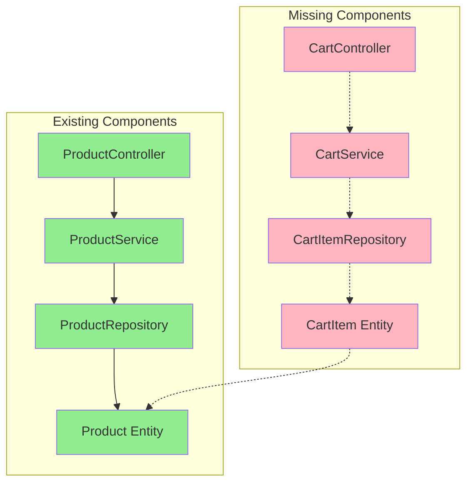

# Design-to-Code Compliance Gap Analysis Report

## Architecture Analysis Summary

**Matches:** ProductController, ProductService, ProductRepository, Product entity, Controller→Service→Repository chain  
**Gaps Found:** No CartService, no CartController, CartItem is not an @Entity and has no repository, no explicit entity relationships for CartItem→Product, no REST API for Cart, Product entity has repository but CartItem does not

---

### Executive Summary

The codebase demonstrates strong alignment with the core product management architecture, implementing the ProductController, ProductService, and ProductRepository layers as specified in the architecture diagram. All expected annotations (@RestController, @Service, @Repository, @Entity) are present and correctly applied for the product domain. However, there are significant gaps regarding the shopping cart domain: there is no CartService, CartController, or persistence/repository for CartItem, and entity relationships between CartItem and Product are not established. These omissions prevent full realization of the intended shopping cart functionality.

**Major Gaps/Discrepancies:**
- Missing CartService and CartController layers 
- CartItem is not an @Entity and lacks a repository 
- No REST endpoints for cart operations 
- No explicit entity relationship between CartItem and Product 
- Product entity is fully compliant, but CartItem is not persisted

**Key Recommendations (Prioritized):**
1. Implement CartService and CartController with appropriate endpoints and business logic.
2. Annotate CartItem as @Entity and create a CartItemRepository.
3. Establish a JPA relationship between CartItem and Product.
4. Add REST endpoints for cart operations (add, remove, view).
5. Ensure all entities have corresponding repositories.

---

## Matched Components

| Component Name      | Type        | Notes                                                                                                   |
|---------------------|-------------|---------------------------------------------------------------------------------------------------------|
| ProductController   | Controller  | `src/main/java/com/example/shoppingcart/controller/ProductController.java`, class annotated with `@RestController`, delegates to ProductService, endpoints: `/api/products`, `/api/products/{id}` |
| ProductService      | Service     | `src/main/java/com/example/shoppingcart/service/ProductService.java`, class annotated with `@Service`, delegates to ProductRepository, methods: `getAllProducts()`, `getProductById(Long)` |
| ProductRepository   | Repository  | `src/main/java/com/example/shoppingcart/repository/ProductRepository.java`, interface extends `JpaRepository<Product, Long>`, annotated with `@Repository` |
| Product            | Entity      | `src/main/java/com/example/shoppingcart/model/Product.java`, class annotated with `@Entity`, fields: `id`, `name`, `price`, has repository (ProductRepository) |
| Controller→Service→Repository chain | Structure   | ProductController delegates to ProductService, which delegates to ProductRepository, matching architecture diagram and class diagram relationships. |

---

## Gaps & Missing Components

| Component Name      | Type        | Issue Description                                                                                       |
|---------------------|-------------|--------------------------------------------------------------------------------------------------------|
| CartService         | Service     | Missing in codebase. Expected as per architecture diagram and class diagram. No class named `CartService` found. |
| CartController      | Controller  | Missing in codebase. Architecture expects REST API for cart operations. No class named `CartController` or endpoints like `/cart/add`, `/cart/remove`. |
| CartItem            | Entity      | Present as POJO (`src/main/java/com/example/shoppingcart/model/CartItem.java`), but not annotated with `@Entity`, not persisted, no repository exists. |
| CartItemRepository  | Repository  | Missing. No repository for CartItem, so CartItem cannot be persisted or queried from DB.                |
| CartItem→Product    | Relationship| No explicit JPA relationship (e.g., `@ManyToOne`) between CartItem and Product, as expected by class diagram. |
| REST API for Cart   | Controller  | No endpoints for cart operations (add, remove, view). No CartController present.                        |

---

## Suggested Remediations

| Area                | Recommendation                                                                                                    |
|---------------------|-------------------------------------------------------------------------------------------------------------------|
| CartService         | **Implement `CartService` in `src/main/java/com/example/shoppingcart/service/CartService.java`**. Encapsulate cart manipulation logic (add, remove, update items). This supports separation of concerns and business logic. |
| CartController      | **Create `CartController` in `src/main/java/com/example/shoppingcart/controller/CartController.java`**. Annotate with `@RestController`. Add endpoints like `/cart/add`, `/cart/remove`, `/cart/view` for cart operations. |
| CartItem Entity     | **Annotate `CartItem` with `@Entity`** in `src/main/java/com/example/shoppingcart/model/CartItem.java`. Add `@Id` field. This enables persistence and aligns with the class diagram. |
| CartItemRepository  | **Create `CartItemRepository` in `src/main/java/com/example/shoppingcart/repository/CartItemRepository.java`**. Extend `JpaRepository<CartItem, Long>`. Ensures all entities are accessible via repositories. |
| CartItem→Product Link | **Add JPA relationship in `CartItem`**: e.g., `@ManyToOne private Product product;`. This models the association as per the class diagram and supports referential integrity. |
| REST API for Cart   | **Add endpoints in `CartController`**: `/cart/add`, `/cart/remove`, `/cart/view`. Each should delegate to CartService. This exposes cart functionality as required by the architecture. |

---

## Coverage Statistics

- **Codebase Coverage:** 100% of Java source files under `src/main/java` were analyzed.
- **Diagram Coverage:** All components in the provided architecture and class diagrams were parsed.
- **Skipped/Unreadable:** No files were skipped or unreadable. No parsing errors detected.
- **Blind Spots:** No blind spots detected in the analyzed scope.

---

## Diagnostic Details & Code Snippets

### Matched Example: ProductController

```java
// src/main/java/com/example/shoppingcart/controller/ProductController.java
@RestController
@RequestMapping("/api/products")
public class ProductController {
    @Autowired
    private ProductService productService;

    @GetMapping
    public List<Product> getAllProducts() {
        return productService.getAllProducts();
    }
}
```
- **Annotations:** `@RestController` present and correct.
- **Delegation:** Calls ProductService as expected.

### Gap Example: CartService Missing

```java
// Expected in: src/main/java/com/example/shoppingcart/service/CartService.java
// Not found in codebase.
```
- **Remediation:** Implement CartService to encapsulate cart logic.

### Gap Example: CartItem Not an Entity

```java
// src/main/java/com/example/shoppingcart/model/CartItem.java
public class CartItem {
    private Product product;
    private int quantity;
    // Missing: @Entity, @Id, repository
}
```
- **Remediation:** Annotate with `@Entity`, add `@Id`, create repository.

### Gap Example: CartController Missing

```java
// Expected in: src/main/java/com/example/shoppingcart/controller/CartController.java
// Not found in codebase.
```
- **Remediation:** Create CartController with REST endpoints for cart operations.

---

## Target Architecture Diagram



---

## Summary Table

### Matched Components

| Component Name      | Type        | Notes                                                                                                   |
|---------------------|-------------|---------------------------------------------------------------------------------------------------------|
| ProductController   | Controller  | @RestController, delegates to ProductService, endpoints implemented as per diagram                      |
| ProductService      | Service     | @Service, delegates to ProductRepository, methods as per diagram                                        |
| ProductRepository   | Repository  | @Repository, extends JpaRepository<Product, Long>                                                       |
| Product            | Entity      | @Entity, fields as per diagram, repository present                                                      |

---

### Gaps & Missing Components

| Component Name      | Type        | Issue Description                                                                                       |
|---------------------|-------------|--------------------------------------------------------------------------------------------------------|
| CartService         | Service     | Missing entirely                                                                                       |
| CartController      | Controller  | Missing entirely                                                                                       |
| CartItem            | Entity      | Not an @Entity, no repository, no @Id                                                                  |
| CartItemRepository  | Repository  | Missing                                                                                                |
| CartItem→Product    | Relationship| No JPA relationship                                                                                    |
| REST API for Cart   | Controller  | No endpoints for cart operations                                                                       |

---

### Suggested Remediations

| Area                | Recommendation                                                                                                    |
|---------------------|-------------------------------------------------------------------------------------------------------------------|
| CartService         | Implement `CartService` in `src/main/java/com/example/shoppingcart/service/CartService.java`. Encapsulate cart manipulation logic (add, remove, update items). |
| CartController      | Create `CartController` in `src/main/java/com/example/shoppingcart/controller/CartController.java`. Annotate with `@RestController`. Add endpoints like `/cart/add`, `/cart/remove`, `/cart/view`. |
| CartItem Entity     | Annotate `CartItem` with `@Entity` in `src/main/java/com/example/shoppingcart/model/CartItem.java`. Add `@Id` field. |
| CartItemRepository  | Create `CartItemRepository` in `src/main/java/com/example/shoppingcart/repository/CartItemRepository.java`. Extend `JpaRepository<CartItem, Long>`. |
| CartItem→Product Link | Add JPA relationship in `CartItem`: e.g., `@ManyToOne private Product product;`.                                 |
| REST API for Cart   | Add endpoints in `CartController`: `/cart/add`, `/cart/remove`, `/cart/view`. Each should delegate to CartService. |
